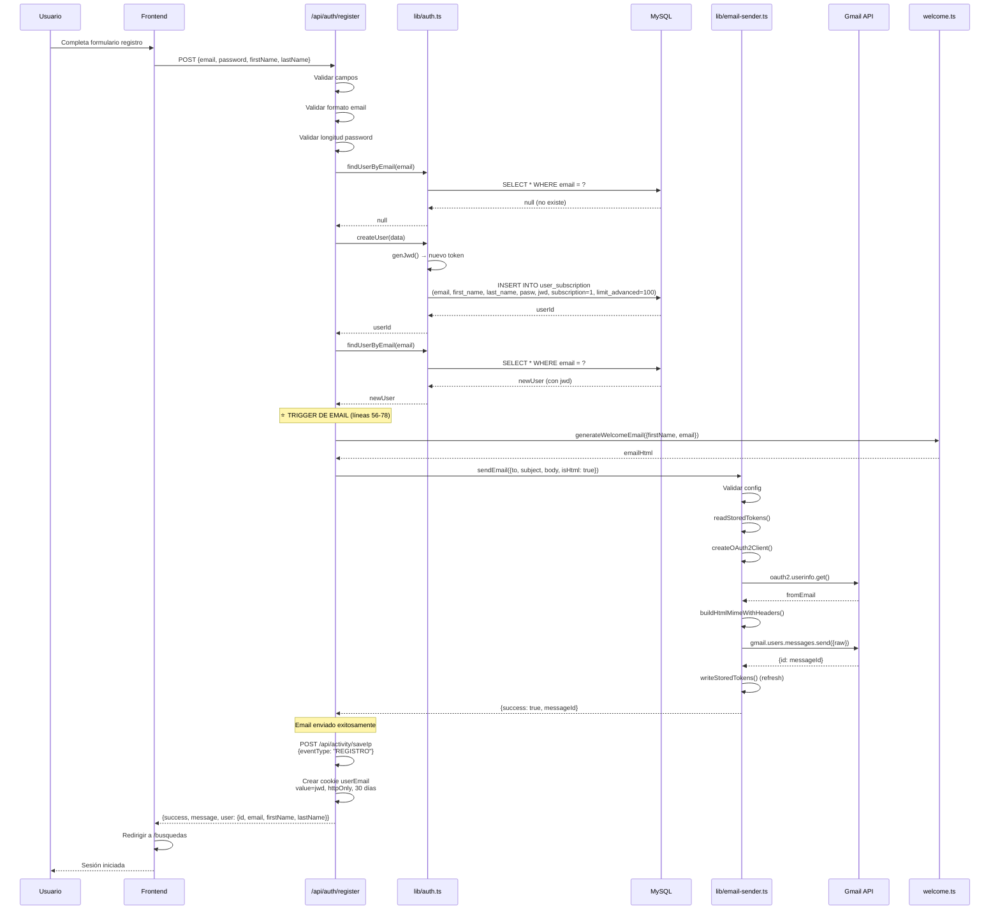
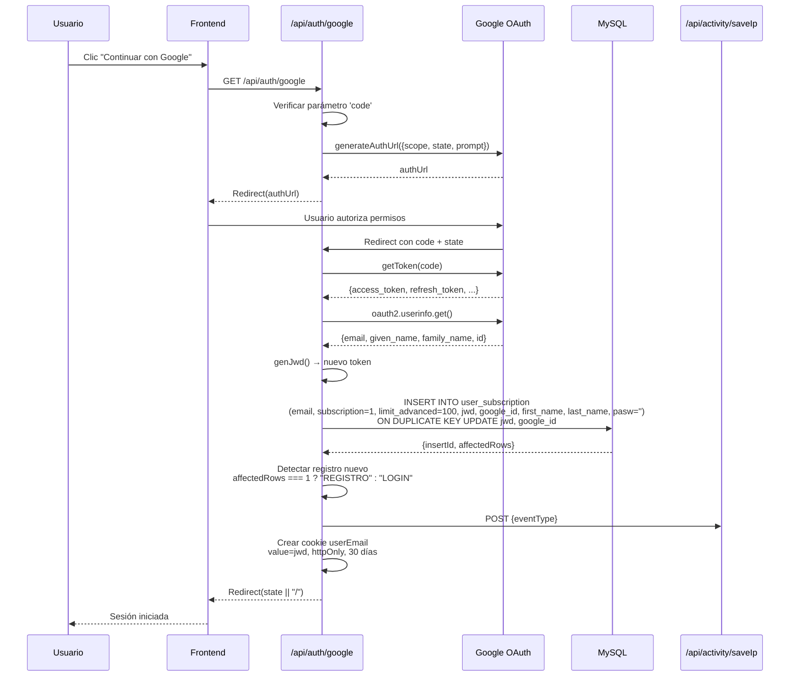
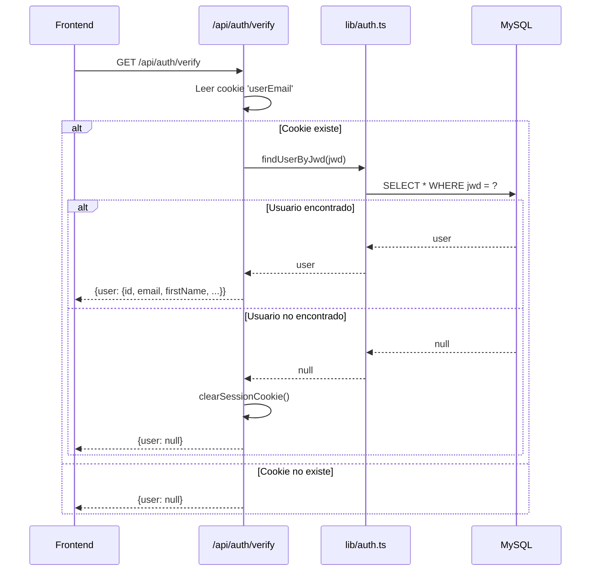
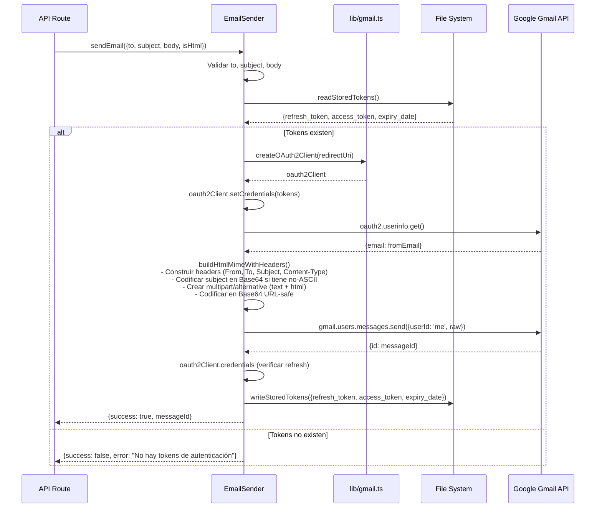

# Sistema de Autenticación con Google y Envío Automático de Emails de Bienvenida

## Tabla de Contenidos

1. [Resumen del Sistema](#resumen-del-sistema)
2. [Arquitectura General](#arquitectura-general)
3. [Componentes del Sistema](#componentes-del-sistema)
   - [3.1 Configuración OAuth y Gmail](#31-configuración-oauth-y-gmail)
   - [3.2 APIs de Autenticación](#32-apis-de-autenticación)
   - [3.3 Servicios de Email](#33-servicios-de-email)
   - [3.4 Plantillas de Email](#34-plantillas-de-email)
   - [3.5 Base de Datos](#35-base-de-datos)
4. [Flujos Completos](#flujos-completos)
5. [Variables de Entorno](#variables-de-entorno)
6. [Diagramas](#diagramas)
7. [Referencia de Archivos](#referencia-de-archivos)

---

## Resumen del Sistema

El sistema implementa autenticación dual (Google OAuth + Email/Password) con envío automático de emails de bienvenida utilizando Gmail API. El flujo principal incluye:

- **Autenticación con Google OAuth 2.0** para login/registro
- **Autenticación tradicional** con email y contraseña
- **Envío automático de emails** de bienvenida después del registro
- **Gestión de sesiones** mediante tokens JWD (JSON Web Data) y cookies httpOnly
- **Logging de actividad** de usuario (LOGIN, REGISTRO)

---

## Arquitectura General

```
┌─────────────────────────────────────────────────────────────────┐
│                        FRONTEND (Next.js)                        │
│  /register, /login, /busquedas                                  │
└──────────────────────────┬──────────────────────────────────────┘
                           │
                           ▼
┌─────────────────────────────────────────────────────────────────┐
│                     MIDDLEWARE (Edge Runtime)                    │
│  Verifica cookie userEmail - Protege /busquedas, /registros    │
└──────────────────────────┬──────────────────────────────────────┘
                           │
                           ▼
┌─────────────────────────────────────────────────────────────────┐
│                         API ROUTES                               │
│                                                                  │
│  ┌────────────────┐  ┌─────────────────┐  ┌─────────────────┐ │
│  │ /api/auth/     │  │ /api/gmail/     │  │ /api/activity/  │ │
│  │ - google       │  │ - send-auth     │  │ - saveIp        │ │
│  │ - register ⭐  │  │ - send          │  │ - logEvent      │ │
│  │ - login        │  │ - disconnect    │  └─────────────────┘ │
│  │ - verify       │  └─────────────────┘                       │
│  │ - logout       │                                             │
│  └────────────────┘                                             │
└──────────────────────────┬──────────────────────────────────────┘
                           │
                           ▼
┌─────────────────────────────────────────────────────────────────┐
│                      SERVICIOS Y LIBRERÍAS                       │
│                                                                  │
│  ┌────────────────┐  ┌─────────────────┐  ┌─────────────────┐ │
│  │ lib/auth.ts    │  │ lib/gmail.ts    │  │ lib/email-      │ │
│  │ - genJwd()     │  │ - OAuth2Client  │  │   sender.ts     │ │
│  │ - createUser() │  │ - Tokens JSON   │  │ - EmailSender   │ │
│  │ - findUser()   │  │ - MIME builders │  │ - sendEmail()   │ │
│  └────────────────┘  └─────────────────┘  └─────────────────┘ │
│                                                                  │
│  ┌────────────────────────────────────────────────────────────┐ │
│  │ lib/email-templates/welcome.ts                             │ │
│  │ - generateWelcomeEmail() ⭐                                 │ │
│  │ - HTML responsive con branding Synara                      │ │
│  └────────────────────────────────────────────────────────────┘ │
└──────────────────────────┬──────────────────────────────────────┘
                           │
                           ▼
┌─────────────────────────────────────────────────────────────────┐
│                    BASE DE DATOS (MySQL)                         │
│  Tabla: user_subscription                                       │
│  Campos: id, email, first_name, last_name, google_id, jwd,     │
│          subscription, limit_advanced, pasw, role, country,     │
│          city, phone, saldo, coins                              │
└─────────────────────────────────────────────────────────────────┘
                           │
                           ▼
┌─────────────────────────────────────────────────────────────────┐
│                     GOOGLE APIS                                  │
│  - Gmail API (envío de emails)                                  │
│  - OAuth2 API (autenticación)                                   │
│  - People API (perfil de usuario)                               │
└─────────────────────────────────────────────────────────────────┘
```

---

## Componentes del Sistema

### 3.1 Configuración OAuth y Gmail

#### **lib/gmail.ts**
📍 `/root/servidores/synara-remaster/lib/gmail.ts`

**Descripción**: Módulo central para configuración de Google OAuth2 y construcción de mensajes MIME para Gmail API.

**Funciones principales**:

```typescript
// Scopes de Gmail API
export const GMAIL_SCOPES = [
  "https://www.googleapis.com/auth/gmail.send",
  "openid", "email", "profile",
]

// Crea cliente OAuth2 con credenciales de Google
export function createOAuth2Client(redirectUri: string)

// Construye mensaje MIME de texto plano
export function buildBase64UrlMimeText(params: {
  from: string
  to: string
  subject: string
  body: string
})

// Construye mensaje MIME multipart/alternative (texto + HTML)
export function buildBase64UrlMimeAlt(params: {
  from: string
  to: string
  subject: string
  text: string
  html: string
})

// Lee tokens OAuth2 desde archivo JSON
export async function readStoredTokens(): Promise<StoredTokens | null>

// Escribe tokens OAuth2 al archivo JSON
export async function writeStoredTokens(tokens: StoredTokens): Promise<void>
```

**Almacenamiento de tokens**:
- Ruta: `/root/servidores/synara-remaster/data/gmail_token.json`
- Formato:
  ```json
  {
    "refresh_token": "1//...",
    "access_token": "ya29...",
    "expiry_date": 1234567890000
  }
  ```

**Variables de entorno requeridas**:
- `GOOGLE_CLIENT_ID`
- `GOOGLE_CLIENT_SECRET`

---

#### **lib/auth.ts**
📍 `/root/servidores/synara-remaster/lib/auth.ts`

**Descripción**: Sistema completo de autenticación con generación de tokens JWD, gestión de sesiones, y operaciones CRUD de usuarios.

**Interface de Usuario**:
```typescript
export interface User {
  id: number
  email: string
  first_name: string | null
  last_name: string | null
  google_id: string | null
  jwd: string | null              // Token de sesión
  subscription: number            // Nivel de suscripción
  limit_advanced: number          // Límite de búsquedas avanzadas
  pasw: string | null
  role: string | null
  country: string | null
  city: string | null
  phone: string | null
  saldo: number | null
  coins: number | null
}
```

**Funciones principales**:

```typescript
// Genera token JWD aleatorio (128 caracteres hex)
export function genJwd(): string

// Busca usuario por email
export async function findUserByEmail(email: string): Promise<User | null>

// Busca usuario por token JWD
export async function findUserByJwd(jwd: string): Promise<User | null>

// Autentica usuario con email y contraseña
export async function authenticate(
  email: string,
  password: string
): Promise<User | null>

// Crea nuevo usuario con suscripción inicial
export async function createUser(data: {
  email: string
  password: string
  firstName: string
  lastName: string
}): Promise<number>

// Actualiza token JWD de usuario
export async function updateUserJwd(userId: number, jwd: string): Promise<void>

// Gestión de sesiones
export async function createSession(user: User)
export async function getSession(): Promise<User | null>
export async function destroySession()

// Verifica autenticación desde request
export async function verifyAuth(
  request: Request
): Promise<{ user: User | null; error?: string }>

// Utilidades de cookies
export function getCookieName(): string    // "userEmail"
export function getCookieDomain(): string  // ".synara.ar"
export function clearSessionCookie()
```

**Configuración de cookies**:
- Nombre: `userEmail`
- Dominio: `.synara.ar` (configurable vía `COOKIE_DOMAIN`)
- Atributos: `httpOnly`, `sameSite: lax`, `secure` (en producción)
- Duración: 30 días (1 semana en `createSession`)

**Variables de entorno**:
- `JWT_SECRET` - Secret para validación de tokens
- `COOKIE_DOMAIN` - Dominio de cookies (default: ".synara.ar")
- `AUTH_JWD_BYTES` - Bytes para generar JWD (default: 64)

---

### 3.2 APIs de Autenticación

#### **app/api/auth/register/route.ts** ⭐ (TRIGGER DE EMAIL)
📍 `/root/servidores/synara-remaster/app/api/auth/register/route.ts`

**Descripción**: Endpoint de registro de usuarios con envío automático de email de bienvenida.

**Método**: `POST`

**Request body**:
```json
{
  "email": "usuario@example.com",
  "password": "contraseña123",
  "firstName": "Juan",
  "lastName": "Pérez"
}
```

**Flujo de ejecución**:
1. Validación de campos (email, password, firstName, lastName)
2. Validación de formato de email (regex)
3. Validación de longitud de contraseña (mínimo 8 caracteres)
4. Verificación de email duplicado
5. **Creación de usuario** con `createUser()`:
   - Inserta en `user_subscription` con `subscription=1`, `limit_advanced=100`
   - Genera token JWD automáticamente
6. **TRIGGER: Envío de email de bienvenida** (líneas 56-78):
   ```typescript
   const emailHtml = generateWelcomeEmail({
     firstName: newUser.first_name || firstName,
     email: newUser.email,
   })

   const emailResult = await sendEmail({
     to: newUser.email,
     subject: "¡Bienvenido a Synara! Tu herramienta de generación de leads está lista",
     body: emailHtml,
     isHtml: true,
   })
   ```
7. **Logging de actividad**: POST a `/api/activity/saveIp` con `eventType: "REGISTRO"`
8. Establecimiento de cookie `userEmail` con JWD
9. Response con datos del usuario

**Response exitoso**:
```json
{
  "success": true,
  "message": "Cuenta creada exitosamente",
  "user": {
    "id": 123,
    "email": "usuario@example.com",
    "firstName": "Juan",
    "lastName": "Pérez"
  }
}
```

**Notas importantes**:
- El email se envía de forma asíncrona
- Si falla el envío de email, **NO falla el registro** (error solo se loguea)
- Cookie se establece con `maxAge: 2592000` (30 días)

**Código del trigger de email** (líneas 56-78):
```typescript
// Enviar email de bienvenida
try {
  const emailHtml = generateWelcomeEmail({
    firstName: newUser.first_name || firstName,
    email: newUser.email,
  })

  const emailResult = await sendEmail({
    to: newUser.email,
    subject: "¡Bienvenido a Synara! Tu herramienta de generación de leads está lista",
    body: emailHtml,
    isHtml: true,
  })

  if (emailResult.success) {
    console.log(`[register] Welcome email sent to ${email}, messageId: ${emailResult.messageId}`)
  } else {
    console.error(`[register] Failed to send welcome email to ${email}:`, emailResult.error)
  }
} catch (emailError) {
  console.error(`[register] Error sending welcome email to ${email}:`, emailError)
  // No fallar el registro si el email falla
}
```

---

#### **app/api/auth/google/route.ts**
📍 `/root/servidores/synara-remaster/app/api/auth/google/route.ts`

**Descripción**: Endpoint dual para autenticación con Google OAuth (GET) y email/password (POST).

**Método GET**: Flujo OAuth con Google

**Parámetros de query**:
- `code` - Código de autorización de Google (opcional, presente en callback)
- `state` - URL de redirección después de login
- `email` - Email para pre-rellenar formulario de Google
- `redirect` - URL de redirección alternativa

**Flujo OAuth**:
1. **Sin código**: Genera URL de autorización de Google y redirige
   ```typescript
   const authUrl = oauth2Client.generateAuthUrl({
     access_type: "offline",
     scope: ["email", "profile"],
     prompt: "consent",
     state: redirectUrl,
     login_hint: email || undefined,
   })
   ```

2. **Con código**: Canjea código por tokens y autentica
   - Obtiene tokens de Google
   - Obtiene perfil de usuario (email, given_name, family_name, id)
   - **INSERT ON DUPLICATE KEY UPDATE** en `user_subscription`:
     ```sql
     INSERT INTO user_subscription
       (email, subscription, limit_advanced, jwd, google_id, first_name, last_name, pasw)
     VALUES (?, 1, 100, ?, ?, ?, ?, ?)
     ON DUPLICATE KEY UPDATE
       jwd = VALUES(jwd),
       google_id = VALUES(google_id),
       id = LAST_INSERT_ID(id)
     ```
   - Detecta si es registro nuevo (`affectedRows === 1`)
   - **Logging de actividad**: "REGISTRO" o "LOGIN"
   - Establece cookie con JWD
   - Redirige a URL solicitada

**Método POST**: Autenticación con email/password

**Request body**:
```json
{
  "email": "usuario@example.com",
  "password": "contraseña",
  "redirect": "/busquedas"
}
```

**Flujo**:
1. Busca usuario por email en `user_subscription`
2. Compara contraseña (texto plano, **sin hashing**)
3. Genera nuevo JWD y actualiza en BD
4. Logging de actividad: "LOGIN"
5. Establece cookie y redirige

**Variables de entorno**:
- `GOOGLE_CLIENT_ID`
- `GOOGLE_CLIENT_SECRET`
- `NEXT_PUBLIC_BASE_URL` (default: "https://synara.ar")
- `COOKIE_DOMAIN` (default: ".synara.ar")
- `AUTH_JWD_BYTES` (default: 64)

---

#### **app/api/auth/login/route.ts**
📍 `/root/servidores/synara-remaster/app/api/auth/login/route.ts`

**Descripción**: Endpoint de login tradicional con email y contraseña.

**Método**: `POST`

**Request body**:
```json
{
  "email": "usuario@example.com",
  "password": "contraseña123"
}
```

**Flujo**:
1. Validación de campos
2. Validación de formato de email
3. Autenticación con `authenticate()` (compara passwords en texto plano)
4. Generación de nuevo JWD
5. Actualización de JWD en base de datos
6. **Logging de actividad**: POST a `/api/activity/saveIp` con `eventType: "LOGIN"`
7. Establecimiento de cookie
8. Response con datos del usuario

---

#### **app/api/auth/verify/route.ts**
📍 `/root/servidores/synara-remaster/app/api/auth/verify/route.ts`

**Descripción**: Verifica validez de sesión actual contra base de datos.

**Método**: `GET`

**Flujo**:
1. Lee cookie `userEmail` (contiene JWD)
2. Busca usuario con `findUserByJwd()`
3. Si no existe, limpia cookie automáticamente
4. Retorna datos completos del usuario

**Response exitoso**:
```json
{
  "user": {
    "id": 123,
    "email": "usuario@example.com",
    "firstName": "Juan",
    "lastName": "Pérez",
    "subscription": 1,
    "limit_advanced": 100,
    "coins": 50,
    "saldo": 1000
  }
}
```

---

#### **app/api/auth/logout/route.ts**
📍 `/root/servidores/synara-remaster/app/api/auth/logout/route.ts`

**Descripción**: Cierra sesión del usuario.

**Método**: `POST`

**Flujo**:
1. Lee JWD de cookie
2. Limpia JWD en base de datos (campo `jwd = ''`)
3. Elimina cookie del cliente
4. Response de confirmación

---

### 3.3 Servicios de Email

#### **lib/email-sender.ts** ⭐
📍 `/root/servidores/synara-remaster/lib/email-sender.ts`

**Descripción**: Servicio principal de envío de emails usando Gmail API con OAuth2. Soporta emails HTML, texto plano, múltiples destinatarios, CC/BCC.

**Clase principal**: `EmailSender`

**Types**:
```typescript
export type EmailConfig = {
  to: string | string[]        // Destinatarios
  subject: string
  body: string
  isHtml?: boolean            // true para HTML, false para texto
  cc?: string | string[]      // Copia
  bcc?: string | string[]     // Copia oculta
}

export type SendEmailResult = {
  success: boolean
  messageId?: string
  error?: string
  details?: string
}
```

**Métodos de EmailSender**:

```typescript
class EmailSender {
  // Verifica si hay tokens OAuth2 válidos
  async hasValidTokens(): Promise<boolean>

  // Obtiene email del usuario autenticado en Gmail
  async getAuthenticatedEmail(): Promise<string | null>

  // Envía un email
  async send(config: EmailConfig): Promise<SendEmailResult>

  // Envía múltiples emails en lote (pausa de 100ms entre cada uno)
  async sendBatch(configs: EmailConfig[]): Promise<SendEmailResult[]>
}
```

**Funciones helper**:
```typescript
// Envío rápido de un email
export async function sendEmail(config: EmailConfig): Promise<SendEmailResult>

// Envío en lote
export async function sendBatchEmails(configs: EmailConfig[]): Promise<SendEmailResult[]>
```

**Características**:
- ✅ Validación de campos (to, subject, body)
- ✅ Soporte para múltiples destinatarios (array o string)
- ✅ Construcción MIME correcta (multipart/alternative para HTML)
- ✅ Codificación de asuntos con caracteres especiales (Base64)
- ✅ Refresh automático de tokens OAuth2
- ✅ Almacenamiento persistente de tokens actualizados
- ✅ Rate limiting (100ms entre emails en lote)

**Ejemplo de uso**:
```typescript
import { sendEmail } from '@/lib/email-sender'

const result = await sendEmail({
  to: 'usuario@example.com',
  subject: '¡Bienvenido!',
  body: '<h1>Hola Mundo</h1>',
  isHtml: true,
  cc: ['copia@example.com'],
  bcc: ['oculta@example.com']
})

if (result.success) {
  console.log('Email enviado:', result.messageId)
} else {
  console.error('Error:', result.error)
}
```

**Construcción de mensajes MIME**:
- Texto plano: Content-Type `text/plain; charset="UTF-8"`
- HTML: `multipart/alternative` con fallback de texto
- Codificación: Base64 URL-safe (reemplaza `+` por `-`, `/` por `_`)

**Manejo de errores**:
- Retorna objeto con `success: false` y `error` descriptivo
- No lanza excepciones (catch interno)
- Incluye `details` con stack trace en caso de error

---

#### **lib/services/email-service.ts**
📍 `/root/servidores/synara-remaster/lib/services/email-service.ts`

**Descripción**: Implementación alternativa con arquitectura SOLID. Separa responsabilidades en clases especializadas.

**Clases**:
- `OAuth2AuthService` - Gestión de autenticación OAuth2
- `MessageBuilderService` - Construcción de mensajes MIME
- `EmailService` - Orquestación de envío
- `EmailServiceFactory` - Factory para crear instancias

**Interface**:
```typescript
interface IEmailService {
  send(config: EmailConfig): Promise<SendEmailResult>
}
```

**Nota**: Este servicio es una alternativa arquitectónica. El sistema actualmente usa `lib/email-sender.ts`.

---

#### **lib/types/email.types.ts**
📍 `/root/servidores/synara-remaster/lib/types/email.types.ts`

**Descripción**: Definiciones de tipos TypeScript y clases de validación.

**Types**:
```typescript
type SimpleEmailConfig = {
  to: string | string[]
  subject: string
  body: string
  isHtml?: boolean
  cc?: string | string[]
  bcc?: string | string[]
}

type EmailSendResult = {
  success: boolean
  messageId?: string
  error?: string
  details?: string
}

type OAuth2Tokens = {
  refresh_token: string | null
  access_token: string | null
  expiry_date: number | null
}

type AuthStatus = {
  isAuthenticated: boolean
  email: string | null
  error?: string
}
```

**Clases de validación**:
```typescript
class EmailValidator {
  static validateEmail(email: string): boolean
  static validateEmailConfig(config: SimpleEmailConfig): { valid: boolean; errors: string[] }
}

class EmailSanitizer {
  static sanitizeSubject(subject: string): string
  static escapeHtml(html: string): string
}
```

---

### 3.4 Plantillas de Email

#### **lib/email-templates/welcome.ts** ⭐
📍 `/root/servidores/synara-remaster/lib/email-templates/welcome.ts`

**Descripción**: Template HTML responsive para email de bienvenida de Synara con branding oficial.

**Interface**:
```typescript
export interface WelcomeEmailData {
  firstName: string
  email: string
}
```

**Función principal**:
```typescript
export function generateWelcomeEmail(data: WelcomeEmailData): string
```

**Características del template**:
- ✅ HTML responsive compatible con clientes de email
- ✅ Diseño con gradiente azul (colores de Synara)
- ✅ Estructura de tablas (mejor compatibilidad)
- ✅ Estilos inline (requerido por clientes de email)
- ✅ Secciones: Header, saludo personalizado, features, CTA, footer

**Paleta de colores Synara**:
- `#28A8FF` - Azul claro (light)
- `#127CF3` - Azul medio (medium)
- `#0056E8` - Azul oscuro (dark)
- `#0D47FF` - Azul texto (text)

**Estructura del email**:
```html
┌─────────────────────────────────────┐
│ HEADER                              │
│ Gradiente azul (#28A8FF → #0056E8) │
│ "¡Bienvenido a Synara!"             │
├─────────────────────────────────────┤
│ CONTENIDO                           │
│ - Saludo personalizado              │
│ - Descripción del servicio          │
│ - Features box (3 características) │
│ - CTA button "Comenzar a buscar"   │
│ - Mensaje de cierre                │
├─────────────────────────────────────┤
│ FOOTER                              │
│ - Descripción de Synara             │
│ - Email de contacto                 │
└─────────────────────────────────────┘
```

**Features destacados**:
1. 🔍 Búsquedas inteligentes en Google Maps
2. 📊 Datos enriquecidos automáticamente
3. ✅ Información lista para accionar

**Función de texto plano**:
```typescript
export function generateWelcomeEmailPlainText(data: WelcomeEmailData): string
```
Genera versión texto plano para fallback en clientes sin HTML.

**Ejemplo de uso**:
```typescript
import { generateWelcomeEmail } from '@/lib/email-templates/welcome'
import { sendEmail } from '@/lib/email-sender'

const emailHtml = generateWelcomeEmail({
  firstName: 'Juan',
  email: 'juan@example.com'
})

await sendEmail({
  to: 'juan@example.com',
  subject: '¡Bienvenido a Synara!',
  body: emailHtml,
  isHtml: true
})
```

---

#### **lib/email-templates/welcome-email.ts**
📍 `/root/servidores/synara-remaster/lib/email-templates/welcome-email.ts`

**Descripción**: Template alternativo para servicio "Albadi Marco" (salud femenina).

**Función**:
```typescript
export function generateWelcomeEmail(userName: string, userEmail: string): string
```

**Características**:
- Gradiente rosa (#e879a3, #f0a4be)
- Branding de Albadi Marco
- Estructura similar al template de Synara

**Nota**: Este template no se usa actualmente en el flujo de registro. Se usa `lib/email-templates/welcome.ts`.

---

### 3.5 Base de Datos

#### **Tabla: user_subscription**
📊 Base de datos: MySQL

**Estructura**:
```sql
CREATE TABLE user_subscription (
  id INT AUTO_INCREMENT PRIMARY KEY,
  email VARCHAR(255) UNIQUE NOT NULL,
  first_name VARCHAR(100),
  last_name VARCHAR(100),
  google_id VARCHAR(255),
  jwd VARCHAR(255),                  -- Token de sesión
  subscription INT DEFAULT 1,        -- Nivel de suscripción
  limit_advanced INT DEFAULT 100,    -- Límite de búsquedas avanzadas
  pasw VARCHAR(255),                 -- Contraseña (texto plano)
  role VARCHAR(50),
  country VARCHAR(100),
  city VARCHAR(100),
  phone VARCHAR(50),
  saldo DECIMAL(10, 2),             -- Saldo monetario
  coins INT                          -- Monedas virtuales
)
```

**Índices**:
- PRIMARY KEY: `id`
- UNIQUE KEY: `email`
- INDEX (recomendado): `jwd` (para búsquedas por token)

**Valores por defecto en registro**:
- `subscription`: 1
- `limit_advanced`: 100
- `jwd`: Generado automáticamente (128 caracteres hex)

**Operaciones principales**:

1. **Registro con email/password**:
   ```sql
   INSERT INTO user_subscription
     (email, first_name, last_name, pasw, jwd, subscription, limit_advanced)
   VALUES (?, ?, ?, ?, ?, 1, 100)
   ```

2. **Login con Google OAuth** (upsert):
   ```sql
   INSERT INTO user_subscription
     (email, subscription, limit_advanced, jwd, google_id, first_name, last_name, pasw)
   VALUES (?, 1, 100, ?, ?, ?, ?, ?)
   ON DUPLICATE KEY UPDATE
     jwd = VALUES(jwd),
     google_id = VALUES(google_id),
     id = LAST_INSERT_ID(id)
   ```

3. **Búsqueda por email**:
   ```sql
   SELECT id, email, first_name, last_name, google_id, jwd, subscription,
          limit_advanced, pasw, role, country, city, phone, saldo, coins
   FROM user_subscription
   WHERE email = ?
   ```

4. **Búsqueda por JWD**:
   ```sql
   SELECT id, email, first_name, last_name, google_id, jwd, subscription,
          limit_advanced, pasw, role, country, city, phone, saldo, coins
   FROM user_subscription
   WHERE jwd = ?
   ```

5. **Actualización de JWD**:
   ```sql
   UPDATE user_subscription
   SET jwd = ?
   WHERE id = ?
   ```

6. **Logout** (limpieza de JWD):
   ```sql
   UPDATE user_subscription
   SET jwd = ''
   WHERE id = ?
   ```

---

#### **lib/db.ts**
📍 `/root/servidores/synara-remaster/lib/db.ts`

**Descripción**: Pool de conexiones MySQL con manejo robusto de errores y reintentos automáticos.

**Configuración**:
```typescript
const pool = mysql.createPool({
  host: process.env.DB_HOST || 'localhost',
  user: process.env.DB_USER || 'root',
  password: process.env.DB_PASSWORD,
  database: process.env.DB_NAME || 'synara_db',
  port: Number(process.env.DB_PORT) || 3306,
  connectionLimit: 50,
  waitForConnections: true,
  queueLimit: 0
})
```

**Características**:
- Pool de 50 conexiones simultáneas
- Reintentos automáticos (3 intentos con backoff exponencial)
- Keep-alive de conexiones
- Recreación automática del pool si se cierra
- Logging detallado de errores

**Función principal**:
```typescript
export async function getConnection(): Promise<mysql.Pool>
```

**Variables de entorno**:
- `DB_HOST` (default: "localhost")
- `DB_USER` (default: "root")
- `DB_PASSWORD`
- `DB_NAME` (default: "synara_db")
- `DB_PORT` (default: 3306)

---

## Flujos Completos

### 🔄 Flujo 1: Registro con Email/Password (CON ENVÍO DE EMAIL)



**Puntos clave**:
- ⭐ El email se envía **automáticamente** después de crear el usuario (línea 56-78)
- Si falla el envío, **NO falla el registro** (error solo se loguea)
- Usuario recibe confirmación visual en el email
- Sesión se inicia automáticamente (cookie establecida)

---

### 🔄 Flujo 2: Login con Google OAuth



**Puntos clave**:
- **INSERT ON DUPLICATE KEY UPDATE**: Si el email ya existe, solo actualiza JWD y google_id
- Detección automática de registro vs login mediante `affectedRows`
- **NO se envía email de bienvenida** en este flujo (solo en registro con email/password)
- Estado (`state`) permite redirección a página solicitada

---

### 🔄 Flujo 3: Verificación de Sesión



**Puntos clave**:
- Validación contra base de datos en cada request
- Limpieza automática de cookies inválidas
- Retorna datos completos del usuario (incluyendo subscription, coins, saldo)

---

### 🔄 Flujo 4: Envío de Email (Detalle Técnico)



**Puntos clave**:
- Tokens se leen desde `/data/gmail_token.json`
- OAuth2 client refresca tokens automáticamente si están expirados
- Construcción MIME cumple estándares RFC 2822 y RFC 2045
- Encoding Base64 URL-safe (reemplaza `+` por `-`, `/` por `_`)
- Tokens actualizados se guardan después de cada envío

---

## Variables de Entorno

### 📋 Archivo .env

```bash
# ==========================================
# GOOGLE OAUTH & GMAIL
# ==========================================
GOOGLE_CLIENT_ID=your-client-id.apps.googleusercontent.com
GOOGLE_CLIENT_SECRET=your-client-secret

# ==========================================
# AUTENTICACIÓN
# ==========================================
JWT_SECRET=your-jwt-secret-key-min-32-chars
COOKIE_DOMAIN=.synara.ar
AUTH_JWD_BYTES=64

# ==========================================
# BASE DE DATOS MYSQL
# ==========================================
DB_HOST=localhost
DB_USER=root
DB_PASSWORD=your-db-password
DB_NAME=synara_db
DB_PORT=3306

# ==========================================
# URLs
# ==========================================
NEXT_PUBLIC_BASE_URL=https://synara.ar

# ==========================================
# SEGURIDAD
# ==========================================
API_INTERNAL_KEY=your-internal-api-key
```

### 📝 Descripción de Variables

| Variable | Descripción | Valor por defecto | Requerida |
|----------|-------------|-------------------|-----------|
| `GOOGLE_CLIENT_ID` | ID de cliente OAuth de Google Cloud Console | - | ✅ Sí |
| `GOOGLE_CLIENT_SECRET` | Secret de cliente OAuth de Google Cloud Console | - | ✅ Sí |
| `JWT_SECRET` | Secret para generación de tokens JWD | - | ✅ Sí |
| `COOKIE_DOMAIN` | Dominio de cookies de sesión | `.synara.ar` | ❌ No |
| `AUTH_JWD_BYTES` | Bytes para generar token JWD (resultado: 2x caracteres hex) | `64` | ❌ No |
| `DB_HOST` | Host del servidor MySQL | `localhost` | ❌ No |
| `DB_USER` | Usuario de MySQL | `root` | ❌ No |
| `DB_PASSWORD` | Contraseña de MySQL | - | ✅ Sí |
| `DB_NAME` | Nombre de la base de datos | `synara_db` | ❌ No |
| `DB_PORT` | Puerto de MySQL | `3306` | ❌ No |
| `NEXT_PUBLIC_BASE_URL` | URL base de la aplicación | `https://synara.ar` | ❌ No |
| `API_INTERNAL_KEY` | Clave para endpoints internos protegidos | - | ⚠️ Sí (para `/api/internal/*`) |

---

## Diagramas

### 📊 Diagrama de Componentes

```
┌─────────────────────────────────────────────────────────────────────────────┐
│                           SISTEMA DE AUTENTICACIÓN                           │
│                          Y ENVÍO AUTOMÁTICO DE EMAILS                        │
└─────────────────────────────────────────────────────────────────────────────┘

┌─────────────────────────────────────────────────────────────────────────────┐
│                              CAPA DE PRESENTACIÓN                            │
├─────────────────────────────────────────────────────────────────────────────┤
│                                                                              │
│  Frontend (Next.js App Router)                                              │
│  ┌──────────────┐  ┌──────────────┐  ┌──────────────┐                     │
│  │  /register   │  │    /login    │  │  /busquedas  │                     │
│  │              │  │              │  │  (protegida) │                     │
│  └──────────────┘  └──────────────┘  └──────────────┘                     │
│                                                                              │
└──────────────────────────────┬──────────────────────────────────────────────┘
                               │
                               ▼
┌─────────────────────────────────────────────────────────────────────────────┐
│                             CAPA DE MIDDLEWARE                               │
├─────────────────────────────────────────────────────────────────────────────┤
│                                                                              │
│  middleware.ts (Edge Runtime)                                               │
│  - Verifica presencia de cookie 'userEmail'                                │
│  - Protege rutas /busquedas, /registros                                    │
│  - Redirige a /login si no hay cookie                                      │
│                                                                              │
└──────────────────────────────┬──────────────────────────────────────────────┘
                               │
                               ▼
┌─────────────────────────────────────────────────────────────────────────────┐
│                               CAPA DE API                                    │
├─────────────────────────────────────────────────────────────────────────────┤
│                                                                              │
│  ┌─────────────────────────────────────────────────────────────────┐       │
│  │ AUTENTICACIÓN                                                    │       │
│  │                                                                  │       │
│  │  /api/auth/register ⭐ (POST)                                    │       │
│  │  ├─ Validar campos                                              │       │
│  │  ├─ createUser() → INSERT con JWD                               │       │
│  │  ├─ generateWelcomeEmail() → HTML                               │       │
│  │  ├─ sendEmail() → Gmail API ⭐ TRIGGER                          │       │
│  │  ├─ Log actividad "REGISTRO"                                    │       │
│  │  └─ Set cookie userEmail                                        │       │
│  │                                                                  │       │
│  │  /api/auth/google (GET/POST)                                    │       │
│  │  ├─ GET: OAuth flow con Google                                 │       │
│  │  │   ├─ generateAuthUrl() → Redirect                            │       │
│  │  │   ├─ Callback con code → getToken()                          │       │
│  │  │   ├─ INSERT ON DUPLICATE KEY UPDATE                          │       │
│  │  │   ├─ Detectar REGISTRO vs LOGIN                              │       │
│  │  │   ├─ Log actividad                                           │       │
│  │  │   └─ Set cookie userEmail                                    │       │
│  │  └─ POST: Email/password tradicional                            │       │
│  │                                                                  │       │
│  │  /api/auth/login (POST)                                         │       │
│  │  ├─ authenticate() → Validar password                           │       │
│  │  ├─ Generar nuevo JWD                                           │       │
│  │  ├─ Log actividad "LOGIN"                                       │       │
│  │  └─ Set cookie userEmail                                        │       │
│  │                                                                  │       │
│  │  /api/auth/verify (GET)                                         │       │
│  │  ├─ Leer cookie userEmail (JWD)                                │       │
│  │  ├─ findUserByJwd() → Validar contra BD                        │       │
│  │  ├─ Si inválido: clearSessionCookie()                          │       │
│  │  └─ Return datos completos del user                            │       │
│  │                                                                  │       │
│  │  /api/auth/logout (POST)                                        │       │
│  │  ├─ Limpiar JWD en BD (jwd = '')                               │       │
│  │  └─ Eliminar cookie userEmail                                  │       │
│  └─────────────────────────────────────────────────────────────────┘       │
│                                                                              │
│  ┌─────────────────────────────────────────────────────────────────┐       │
│  │ GMAIL & ENVÍO DE EMAILS                                          │       │
│  │                                                                  │       │
│  │  /api/gmail/send-auth (GET)                                     │       │
│  │  ├─ Iniciar OAuth para permisos Gmail                          │       │
│  │  ├─ Canjear code por tokens                                     │       │
│  │  └─ Guardar en /data/gmail_token.json                          │       │
│  │                                                                  │       │
│  │  /api/gmail/send (POST)                                         │       │
│  │  └─ Envío directo vía Gmail API                                │       │
│  │                                                                  │       │
│  │  /api/internal/send-email (POST)                                │       │
│  │  ├─ Protegido con x-internal-key                               │       │
│  │  └─ Envío programático de emails                               │       │
│  │                                                                  │       │
│  │  /api/test/send-welcome-email (POST)                            │       │
│  │  └─ Testing de email de bienvenida                             │       │
│  └─────────────────────────────────────────────────────────────────┘       │
│                                                                              │
│  ┌─────────────────────────────────────────────────────────────────┐       │
│  │ ACTIVIDAD                                                        │       │
│  │                                                                  │       │
│  │  /api/activity/saveIp (POST)                                    │       │
│  │  ├─ Registrar evento (LOGIN, REGISTRO, SEARCH)                 │       │
│  │  ├─ Capturar IP, user agent, país, ciudad                      │       │
│  │  └─ INSERT en user_activity_logs                               │       │
│  └─────────────────────────────────────────────────────────────────┘       │
│                                                                              │
└──────────────────────────────┬──────────────────────────────────────────────┘
                               │
                               ▼
┌─────────────────────────────────────────────────────────────────────────────┐
│                          CAPA DE SERVICIOS Y LÓGICA                          │
├─────────────────────────────────────────────────────────────────────────────┤
│                                                                              │
│  ┌──────────────────────────────────────────────────────────────┐          │
│  │ lib/auth.ts                                                   │          │
│  │                                                               │          │
│  │  Autenticación Core:                                         │          │
│  │  ├─ genJwd() → Genera token 128 chars hex                   │          │
│  │  ├─ findUserByEmail(email) → SELECT                          │          │
│  │  ├─ findUserByJwd(jwd) → SELECT                             │          │
│  │  ├─ authenticate(email, password) → Validar                  │          │
│  │  ├─ createUser(data) → INSERT + genJwd()                    │          │
│  │  └─ updateUserJwd(userId, jwd) → UPDATE                     │          │
│  │                                                               │          │
│  │  Gestión de sesiones:                                        │          │
│  │  ├─ createSession(user) → Set cookie                        │          │
│  │  ├─ getSession() → Read cookie + findUserByJwd()            │          │
│  │  ├─ destroySession() → Clear JWD + cookie                   │          │
│  │  ├─ verifyAuth(request) → Validar sesión                    │          │
│  │  └─ clearSessionCookie() → Eliminar cookie                  │          │
│  │                                                               │          │
│  │  Constantes:                                                 │          │
│  │  ├─ COOKIE_NAME = "userEmail"                               │          │
│  │  └─ COOKIE_DOMAIN = ".synara.ar"                            │          │
│  └──────────────────────────────────────────────────────────────┘          │
│                                                                              │
│  ┌──────────────────────────────────────────────────────────────┐          │
│  │ lib/gmail.ts                                                  │          │
│  │                                                               │          │
│  │  OAuth2 & MIME:                                              │          │
│  │  ├─ createOAuth2Client(redirectUri) → OAuth2                │          │
│  │  ├─ buildBase64UrlMimeText(params) → Texto plano            │          │
│  │  └─ buildBase64UrlMimeAlt(params) → HTML multipart          │          │
│  │                                                               │          │
│  │  Token Management:                                            │          │
│  │  ├─ readStoredTokens() → Read JSON                          │          │
│  │  └─ writeStoredTokens(tokens) → Write JSON                  │          │
│  │                                                               │          │
│  │  Scopes:                                                      │          │
│  │  └─ ["gmail.send", "openid", "email", "profile"]           │          │
│  └──────────────────────────────────────────────────────────────┘          │
│                                                                              │
│  ┌──────────────────────────────────────────────────────────────┐          │
│  │ lib/email-sender.ts ⭐                                        │          │
│  │                                                               │          │
│  │  class EmailSender {                                         │          │
│  │    ├─ hasValidTokens() → Verificar tokens                   │          │
│  │    ├─ getAuthenticatedEmail() → Email del remitente         │          │
│  │    ├─ send(config) → Envío individual                       │          │
│  │    │   ├─ Validar config (to, subject, body)                │          │
│  │    │   ├─ readStoredTokens()                                │          │
│  │    │   ├─ createOAuth2Client()                              │          │
│  │    │   ├─ oauth2.userinfo.get() → fromEmail                 │          │
│  │    │   ├─ buildHtmlMimeWithHeaders() o buildTextMime...()   │          │
│  │    │   ├─ gmail.users.messages.send({raw})                  │          │
│  │    │   └─ writeStoredTokens() (refresh)                     │          │
│  │    └─ sendBatch(configs[]) → Envío en lote                  │          │
│  │  }                                                            │          │
│  │                                                               │          │
│  │  Helper functions:                                           │          │
│  │  ├─ sendEmail(config) → Wrapper rápido                      │          │
│  │  └─ sendBatchEmails(configs[])                              │          │
│  └──────────────────────────────────────────────────────────────┘          │
│                                                                              │
│  ┌──────────────────────────────────────────────────────────────┐          │
│  │ lib/email-templates/welcome.ts ⭐                             │          │
│  │                                                               │          │
│  │  Templates:                                                   │          │
│  │  ├─ generateWelcomeEmail(data) → HTML responsive            │          │
│  │  │   ├─ Header con gradiente azul Synara                    │          │
│  │  │   ├─ Saludo personalizado con firstName                  │          │
│  │  │   ├─ Features box (3 características)                     │          │
│  │  │   ├─ CTA button → https://synara.ar                      │          │
│  │  │   └─ Footer con contacto                                 │          │
│  │  └─ generateWelcomeEmailPlainText(data) → Texto plano       │          │
│  │                                                               │          │
│  │  Colores Synara:                                             │          │
│  │  ├─ #28A8FF (light blue)                                    │          │
│  │  ├─ #127CF3 (medium blue)                                   │          │
│  │  └─ #0056E8 (dark blue)                                     │          │
│  └──────────────────────────────────────────────────────────────┘          │
│                                                                              │
└──────────────────────────────┬──────────────────────────────────────────────┘
                               │
                               ▼
┌─────────────────────────────────────────────────────────────────────────────┐
│                            CAPA DE PERSISTENCIA                              │
├─────────────────────────────────────────────────────────────────────────────┤
│                                                                              │
│  ┌──────────────────────────────────────────────────────────────┐          │
│  │ lib/db.ts                                                     │          │
│  │                                                               │          │
│  │  MySQL Connection Pool:                                      │          │
│  │  ├─ connectionLimit: 50                                      │          │
│  │  ├─ Reintentos automáticos (3 intentos)                     │          │
│  │  ├─ Backoff exponencial                                      │          │
│  │  ├─ Keep-alive de conexiones                                │          │
│  │  └─ Recreación automática del pool                          │          │
│  │                                                               │          │
│  │  export async function getConnection()                       │          │
│  └──────────────────────────────────────────────────────────────┘          │
│                                                                              │
│  ┌──────────────────────────────────────────────────────────────┐          │
│  │ MySQL Database: synara_db                                    │          │
│  │                                                               │          │
│  │  Tabla: user_subscription                                    │          │
│  │  ├─ id (PK, AUTO_INCREMENT)                                 │          │
│  │  ├─ email (UNIQUE, NOT NULL)                                │          │
│  │  ├─ first_name                                               │          │
│  │  ├─ last_name                                                │          │
│  │  ├─ google_id                                                │          │
│  │  ├─ jwd (token de sesión)                                   │          │
│  │  ├─ subscription (default: 1)                                │          │
│  │  ├─ limit_advanced (default: 100)                            │          │
│  │  ├─ pasw (contraseña texto plano)                           │          │
│  │  ├─ role                                                      │          │
│  │  ├─ country, city, phone                                     │          │
│  │  ├─ saldo (DECIMAL)                                          │          │
│  │  └─ coins (INT)                                              │          │
│  │                                                               │          │
│  │  Tabla: user_activity_logs                                   │          │
│  │  ├─ id, user_id, event_type                                 │          │
│  │  ├─ ip_address, user_agent                                  │          │
│  │  ├─ country, city                                            │          │
│  │  └─ created_at                                               │          │
│  └──────────────────────────────────────────────────────────────┘          │
│                                                                              │
│  ┌──────────────────────────────────────────────────────────────┐          │
│  │ File System: /data/gmail_token.json                          │          │
│  │                                                               │          │
│  │  {                                                            │          │
│  │    "refresh_token": "1//...",                                │          │
│  │    "access_token": "ya29...",                                │          │
│  │    "expiry_date": 1234567890000                              │          │
│  │  }                                                            │          │
│  └──────────────────────────────────────────────────────────────┘          │
│                                                                              │
└──────────────────────────────┬──────────────────────────────────────────────┘
                               │
                               ▼
┌─────────────────────────────────────────────────────────────────────────────┐
│                          SERVICIOS EXTERNOS                                  │
├─────────────────────────────────────────────────────────────────────────────┤
│                                                                              │
│  ┌──────────────────────────────────────────────────────────────┐          │
│  │ Google APIs                                                   │          │
│  │                                                               │          │
│  │  Gmail API:                                                   │          │
│  │  ├─ gmail.users.messages.send() → Enviar email              │          │
│  │  └─ Requiere scope: gmail.send                              │          │
│  │                                                               │          │
│  │  OAuth2 API:                                                  │          │
│  │  ├─ oauth2.generateAuthUrl() → Iniciar flow                 │          │
│  │  ├─ oauth2.getToken(code) → Canjear code                    │          │
│  │  └─ oauth2.userinfo.get() → Perfil de usuario               │          │
│  │                                                               │          │
│  │  Scopes necesarios:                                           │          │
│  │  ├─ https://www.googleapis.com/auth/gmail.send              │          │
│  │  ├─ openid                                                    │          │
│  │  ├─ email                                                     │          │
│  │  └─ profile                                                   │          │
│  └──────────────────────────────────────────────────────────────┘          │
│                                                                              │
└─────────────────────────────────────────────────────────────────────────────┘
```

---

### 🔥 Diagrama de Flujo: Registro + Email Automático

```
START: Usuario en /register
     |
     ▼
┌─────────────────────────────────┐
│ 1. Frontend: Captura datos     │
│    - email                      │
│    - password                   │
│    - firstName                  │
│    - lastName                   │
└────────────┬────────────────────┘
             │
             ▼
┌─────────────────────────────────┐
│ 2. POST /api/auth/register      │
└────────────┬────────────────────┘
             │
             ▼
┌─────────────────────────────────┐
│ 3. Validaciones                 │
│    ✓ Campos requeridos          │
│    ✓ Formato email válido       │
│    ✓ Password >= 8 chars        │
└────────────┬────────────────────┘
             │
             ▼
┌─────────────────────────────────┐
│ 4. Verificar email duplicado    │
│    findUserByEmail(email)       │
└────────────┬────────────────────┘
             │
        ┌────┴────┐
        │ Existe? │
        └────┬────┘
             │ NO
             ▼
┌─────────────────────────────────┐
│ 5. Crear usuario                │
│    createUser(data)             │
│    ├─ genJwd() → token          │
│    └─ INSERT INTO               │
│       user_subscription         │
│       (email, first_name,       │
│        last_name, pasw, jwd,    │
│        subscription=1,          │
│        limit_advanced=100)      │
└────────────┬────────────────────┘
             │
             ▼
┌─────────────────────────────────┐
│ 6. Obtener usuario creado       │
│    findUserByEmail(email)       │
│    → newUser (con jwd)          │
└────────────┬────────────────────┘
             │
             ▼
┌═════════════════════════════════┐
║ 7. ⭐ TRIGGER DE EMAIL          ║
║    (líneas 56-78)               ║
╠═════════════════════════════════╣
║ 7.1 Generar HTML                ║
║     generateWelcomeEmail({      ║
║       firstName,                ║
║       email                     ║
║     })                          ║
║     → emailHtml                 ║
╟─────────────────────────────────╢
║ 7.2 Enviar email                ║
║     sendEmail({                 ║
║       to: email,                ║
║       subject: "¡Bienvenido!",  ║
║       body: emailHtml,          ║
║       isHtml: true              ║
║     })                          ║
╟─────────────────────────────────╢
║ 7.2.1 EmailSender.send()        ║
║   ├─ Validar config             ║
║   ├─ readStoredTokens()         ║
║   ├─ createOAuth2Client()       ║
║   ├─ oauth2.userinfo.get()      ║
║   │   → fromEmail                ║
║   ├─ buildHtmlMimeWithHeaders() ║
║   │   ├─ Encode subject (Base64)║
║   │   ├─ Create multipart/alt   ║
║   │   └─ Base64 URL-safe encode ║
║   ├─ gmail.users.messages.send()║
║   │   → messageId               ║
║   └─ writeStoredTokens()        ║
╟─────────────────────────────────╢
║ 7.3 Log resultado               ║
║   ┌─────────┐                   ║
║   │ Success?│                   ║
║   └────┬────┘                   ║
║     SI │ NO                     ║
║        │  └→ console.error()    ║
║        └→ console.log(messageId)║
║                                 ║
║ NOTA: Email falla NO bloquea   ║
║       el registro               ║
└════════════┬════════════════════┘
             │
             ▼
┌─────────────────────────────────┐
│ 8. Log actividad                │
│    POST /api/activity/saveIp    │
│    { eventType: "REGISTRO" }    │
│    (async, no espera response)  │
└────────────┬────────────────────┘
             │
             ▼
┌─────────────────────────────────┐
│ 9. Establecer cookie            │
│    name: "userEmail"            │
│    value: jwd                   │
│    domain: ".synara.ar"         │
│    httpOnly: true               │
│    sameSite: "lax"              │
│    secure: true (production)    │
│    maxAge: 30 días              │
└────────────┬────────────────────┘
             │
             ▼
┌─────────────────────────────────┐
│ 10. Response exitoso            │
│     {                           │
│       success: true,            │
│       message: "Cuenta creada", │
│       user: {id, email, ...}    │
│     }                           │
└────────────┬────────────────────┘
             │
             ▼
┌─────────────────────────────────┐
│ 11. Frontend recibe response    │
│     - Guarda datos en estado    │
│     - Redirige a /busquedas     │
└────────────┬────────────────────┘
             │
             ▼
┌─────────────────────────────────┐
│ END: Usuario logueado           │
│      Email de bienvenida        │
│      enviado a su inbox         │
└─────────────────────────────────┘
```

---

## Referencia de Archivos

### 📁 Estructura de Archivos

```
/root/servidores/synara-remaster/
│
├── app/
│   └── api/
│       ├── auth/
│       │   ├── google/
│       │   │   └── route.ts               ⭐ OAuth Google + Email/Password login
│       │   ├── register/
│       │   │   └── route.ts               ⭐⭐ Registro + TRIGGER EMAIL
│       │   ├── login/
│       │   │   └── route.ts               Login tradicional
│       │   ├── verify/
│       │   │   └── route.ts               Verificación de sesión
│       │   └── logout/
│       │       └── route.ts               Cierre de sesión
│       │
│       ├── gmail/
│       │   ├── send-auth/
│       │   │   └── route.ts               OAuth para permisos Gmail
│       │   ├── send/
│       │   │   └── route.ts               Envío directo Gmail
│       │   └── disconnect/
│       │       └── route.ts               Desconexión Gmail
│       │
│       ├── activity/
│       │   ├── saveIp/
│       │   │   └── route.ts               Registro de actividad
│       │   └── logEvent/
│       │       └── route.ts               Logging de eventos
│       │
│       ├── internal/
│       │   └── send-email/
│       │       └── route.ts               API interna protegida
│       │
│       └── test/
│           └── send-welcome-email/
│               └── route.ts               Testing de emails
│
├── lib/
│   ├── auth.ts                            ⭐ Sistema de autenticación core
│   ├── gmail.ts                           ⭐ OAuth2 + MIME builders
│   ├── email-sender.ts                    ⭐⭐ Servicio de envío de emails
│   ├── db.ts                              Pool de conexiones MySQL
│   ├── auth-client.ts                     Utilidades de auth cliente
│   │
│   ├── services/
│   │   └── email-service.ts               Servicio email SOLID
│   │
│   ├── types/
│   │   └── email.types.ts                 Types y validadores
│   │
│   └── email-templates/
│       ├── welcome.ts                     ⭐⭐ Template bienvenida Synara
│       └── welcome-email.ts               Template alternativo (Albadi Marco)
│
├── middleware.ts                          Middleware de autenticación Edge
│
├── data/
│   └── gmail_token.json                   ⭐ Tokens OAuth2 persistentes
│
├── docs/
│   └── AUTHENTICATION_FLOW.md             Documentación de autenticación
│
└── .env                                   Variables de entorno
```

### 🔑 Leyenda de Símbolos

- ⭐ - Componente importante
- ⭐⭐ - Componente crítico (punto de entrada de trigger de email)
- 📍 - Ubicación de archivo
- 🔄 - Flujo de ejecución
- 📊 - Base de datos / Schema
- ✅ - Característica o validación

---

### 📋 Lista Completa de Archivos por Categoría

#### **Configuración y Autenticación**
1. `/root/servidores/synara-remaster/lib/gmail.ts` - OAuth2 y MIME
2. `/root/servidores/synara-remaster/lib/auth.ts` - Sistema de autenticación
3. `/root/servidores/synara-remaster/lib/auth-client.ts` - Utilidades cliente

#### **APIs de Autenticación**
4. `/root/servidores/synara-remaster/app/api/auth/register/route.ts` ⭐ TRIGGER
5. `/root/servidores/synara-remaster/app/api/auth/google/route.ts`
6. `/root/servidores/synara-remaster/app/api/auth/login/route.ts`
7. `/root/servidores/synara-remaster/app/api/auth/verify/route.ts`
8. `/root/servidores/synara-remaster/app/api/auth/logout/route.ts`

#### **APIs de Gmail**
9. `/root/servidores/synara-remaster/app/api/gmail/send-auth/route.ts`
10. `/root/servidores/synara-remaster/app/api/gmail/send/route.ts`
11. `/root/servidores/synara-remaster/app/api/gmail/disconnect/route.ts`

#### **Servicios de Email**
12. `/root/servidores/synara-remaster/lib/email-sender.ts` ⭐ Principal
13. `/root/servidores/synara-remaster/lib/services/email-service.ts`
14. `/root/servidores/synara-remaster/lib/types/email.types.ts`

#### **Plantillas de Email**
15. `/root/servidores/synara-remaster/lib/email-templates/welcome.ts` ⭐ Synara
16. `/root/servidores/synara-remaster/lib/email-templates/welcome-email.ts`

#### **Base de Datos**
17. `/root/servidores/synara-remaster/lib/db.ts`

#### **Middleware**
18. `/root/servidores/synara-remaster/middleware.ts`

#### **APIs de Testing e Internos**
19. `/root/servidores/synara-remaster/app/api/test/send-welcome-email/route.ts`
20. `/root/servidores/synara-remaster/app/api/internal/send-email/route.ts`

#### **Actividad**
21. `/root/servidores/synara-remaster/app/api/activity/saveIp/route.ts`
22. `/root/servidores/synara-remaster/app/api/activity/logEvent/route.ts`

#### **Datos Persistentes**
23. `/root/servidores/synara-remaster/data/gmail_token.json` - Tokens OAuth2

#### **Documentación**
24. `/root/servidores/synara-remaster/docs/AUTHENTICATION_FLOW.md`

---

## Notas de Seguridad

### ⚠️ Vulnerabilidades Actuales

1. **Contraseñas en texto plano**
   - Las contraseñas se almacenan sin hashing en el campo `pasw`
   - Ubicaciones: `lib/auth.ts:93`, `app/api/auth/google/route.ts:60`
   - **Recomendación**: Implementar bcrypt para hashing
     ```typescript
     import bcrypt from 'bcryptjs'
     const hashedPassword = await bcrypt.hash(password, 10)
     const isValid = await bcrypt.compare(password, user.pasw)
     ```

2. **Token JWD Custom**
   - Se usa un sistema custom de tokens en lugar de JWT estándar
   - No hay expiración de tokens (permanecen válidos hasta logout)
   - **Recomendación**: Migrar a JWT con expiración

3. **Cookie Domain**
   - Cookie establecida en `.synara.ar` (wildcard)
   - Puede ser vulnerable a subdomain takeover
   - **Recomendación**: Usar dominio específico o implementar SameSite=Strict

### ✅ Buenas Prácticas Implementadas

1. ✅ Cookies httpOnly (previene XSS)
2. ✅ Cookies secure en producción
3. ✅ SameSite=lax (protección CSRF)
4. ✅ Validación de email con regex
5. ✅ Longitud mínima de contraseña (8 caracteres)
6. ✅ Sanitización de URLs de redirección
7. ✅ Logging de actividad de usuario
8. ✅ Manejo robusto de errores en envío de emails
9. ✅ Tokens OAuth2 almacenados de forma segura

---

## Testing

### 🧪 Endpoint de Testing

**Probar envío de email de bienvenida sin crear usuario**:

```bash
curl -X POST https://synara.ar/api/test/send-welcome-email \
  -H "Content-Type: application/json" \
  -d '{
    "email": "test@example.com",
    "firstName": "Juan"
  }'
```

**Response esperado**:
```json
{
  "success": true,
  "message": "Email de prueba enviado exitosamente",
  "result": {
    "success": true,
    "messageId": "18c9f1234567890a"
  }
}
```

### 🔍 Debugging

**Logs importantes a revisar**:

```bash
# Registro exitoso con email
[register] New user registered: usuario@example.com
[register] Welcome email sent to usuario@example.com, messageId: 18c9f...

# Registro con error de email
[register] Failed to send welcome email to usuario@example.com: No hay tokens de autenticación

# Google OAuth login/registro
[google-auth] REGISTRO for usuario@example.com
[google-auth] LOGIN for usuario@example.com

# Email sender
[EmailSender] Error: Invalid grant
```

---

## Mantenimiento

### 🔄 Refresh de Tokens Gmail

Los tokens OAuth2 de Gmail se refrescan automáticamente en cada envío de email. El token actualizado se guarda en `/data/gmail_token.json`.

**Verificar estado de tokens**:
```typescript
import { EmailSender } from '@/lib/email-sender'

const sender = new EmailSender()
const hasTokens = await sender.hasValidTokens()
const email = await sender.getAuthenticatedEmail()

console.log('Has tokens:', hasTokens)
console.log('Authenticated as:', email)
```

### 📝 Regenerar Tokens Gmail

Si los tokens expiran o se corrompen:

1. Navegar a: `https://synara.ar/api/gmail/send-auth`
2. Autorizar permisos de Gmail en Google
3. Tokens se guardarán automáticamente en `/data/gmail_token.json`

---

## Conclusión

Este sistema implementa un flujo completo de autenticación con Google OAuth y email/password, con envío automático de emails de bienvenida utilizando Gmail API. Los componentes clave son:

1. **Trigger principal**: `app/api/auth/register/route.ts` (líneas 56-78)
2. **Servicio de email**: `lib/email-sender.ts` (clase `EmailSender`)
3. **Template HTML**: `lib/email-templates/welcome.ts` (`generateWelcomeEmail()`)
4. **OAuth2 config**: `lib/gmail.ts` (tokens persistentes en JSON)

El sistema es robusto, con manejo de errores y logging completo, asegurando que el registro de usuario **nunca falle** debido a problemas de envío de email.

---

**Documento generado el**: 2025-11-17
**Sistema**: Synara - Inteligencia Comercial B2B
**Versión**: 1.0
